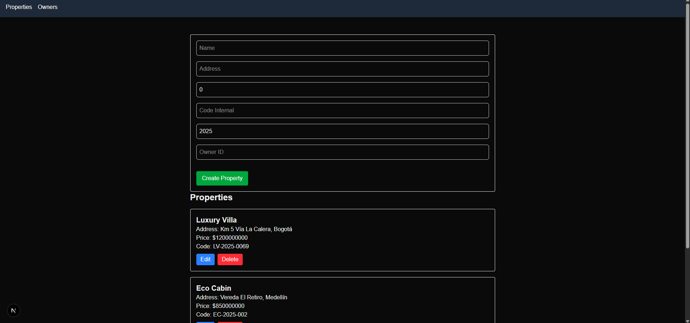

# Million technical Test

Sistema de Gestión de propiedades

Este proyecto consiste en una prueba técnica, la cual está estructurada de la siguiente forma:

<ul>
  <li>DB - Collecciones creadas como almacen de datos, en MongoDB</li>
  <li>million-frontend-service - Cliente desarrollado en NextJS (versión 15.5)</li>
  <li>API - API Desarrollada con NetCore 8</li>
</ul>

Se desarrolla este proyecto teniendo en cuenta las versiones más actuales y estables de las tecnologías anteriormente mencionadas. Se tienen en cuenta patrones de desarrollo y código limpio para que sea escalable en el futuro. Además, se realiza el proyecto en inglés para una mejor comprensión.

### Desarrollo de la prueba

Para que la aplicación funcione correctamente, es necesario tener en cuenta los siguientes pasos:

Obtener el repositorio <link> https://github.com/Katlan9808/MillionTechnicalTest.git

### Base de datos
Restablecer las colecciones en ambiente MongoDB:
<ul>
  <li>1.MillionDatabase.Owner.json</li>
  <li>2.MillionDatabase.Property.json</li>
  <li>3.MillionDatabase.PropertyImage.json</li>
  <li>4.MillionDatabase.PropertyTrace.json</li>
</ul>

En estos scripts se encuentra la forma de restablecer las colecciones de base de datos que se necesitarán.

### million-frontend-service
En este proyecto se encuentra la estructura del cliente, que se desarrolló en NextJS.  
En la ruta de la carpeta <strong>\TaskClient</strong> ejecutar <code>million-frontend-service</code>, para obtener todos los paquetes requeridos para que el cliente funcione. En el cliente, se pueden realizar las operaciones CRUD y los demás puntos solicitados.

Para el consumo de la API desde el cliente se, utiliza `Axios`, ya que con este objeto se realizan solicitudes HTTP y se maneja la respuesta del servidor. El servicio HttpClient tiene la responsabilidad de implementar otras funcionalidades como interceptores y encabezados.

### API
En este proyecto se encuentra el backend de la aplicación, desarrollado implementando la arquitectura hexagonal. Esta arquitectura nos expone una aplicación totalmente independiente que puede ser usada de la misma forma por usuarios, programas, pruebas automatizadas o scripts, y puede ser desarrollada y probada de forma aislada de sus eventuales dispositivos y bases de datos en tiempo de ejecución.

### Estructura del proyecto

<ul>
  <li>ApiMillion</li>
  <li>Million.Utilities</li>
  <li>Million.UnitTest</li>
  <li>Million.Models</li>
  <li>Million.Domain</li>
  <li>Million.DataInfrastructure</li>
  <li>Million.Application</li>
</ul>

Se comienza a crear el proyecto desde la capa de Domain, ya que así es como se orienta en la arquitectura hexagonal.

Se incluye una capa transversal <strong>Million.Utilities</strong>,  la cual contiene datos y parámetros.

Ejecutar la aplicación para que el cliente pueda recibir las peticiones. En la API, se evidencia la estructura completa de la Arquitectura Hexagonal, con un proyecto adicional de NUnit, el cual se creó para realizar las pruebas unitarias.

## Imágenes de la aplicación

### Bienvenida

### Properties

### Owners

### API

### DB

